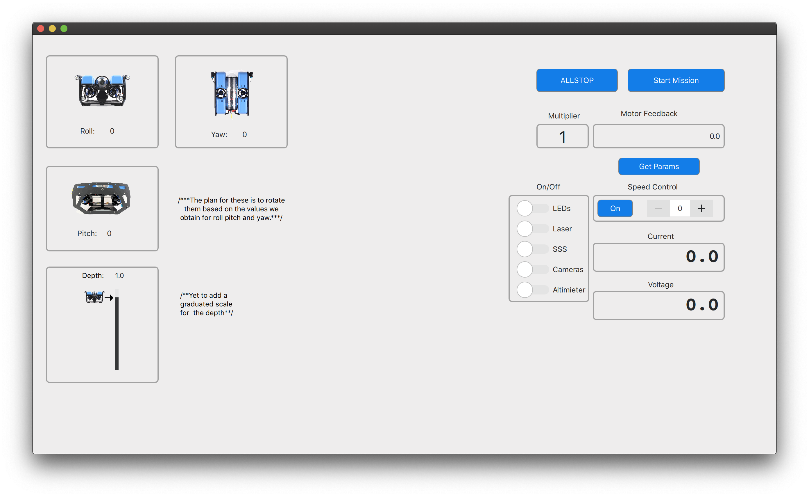

UI so far: 

You can clone this repo and build it using qmake. Then run make to generate the app BlueRovGUI.app. 

Make sure to have Qt and all it's dependencies installed. ;)

More improvements on the way!
